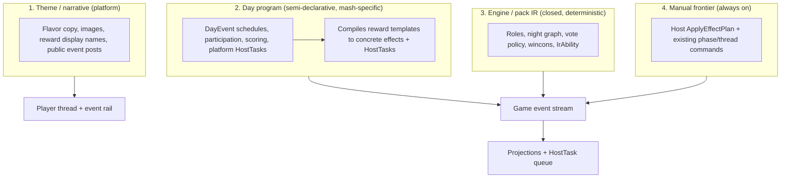
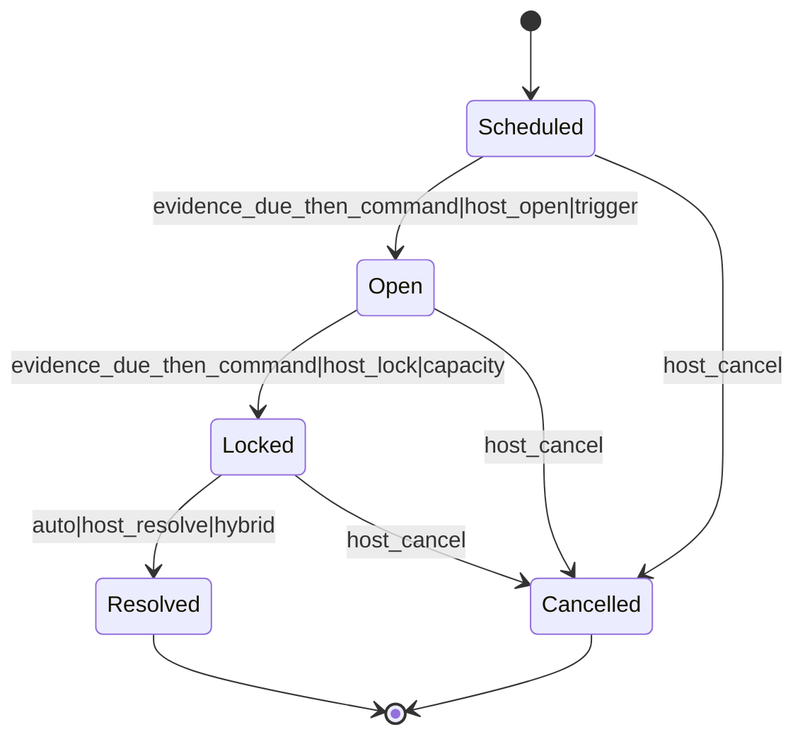
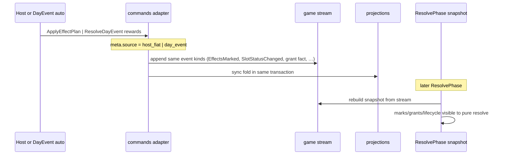
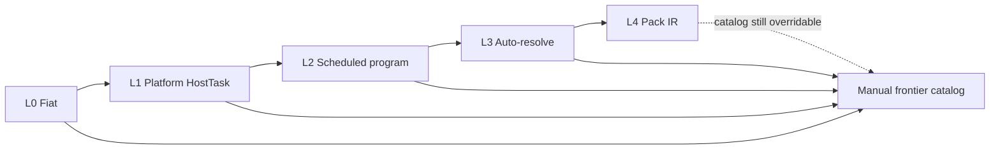

# 14 — Mash culture support and the permanent manual frontier

| Field | Value |
|---|---|
| **Document** | `docs/arch/14-mash-and-manual-frontier.md` (proposed) |
| **Author** | TBD |
| **Date** | 2026-07-22 |
| **Status** | Draft (rev 4 — prerequisite and vertical-slice review) |
| **Depends on** | [00](00-vision.md), [01](01-domain-model.md), [02](02-event-sourcing.md), [06](06-security.md), [09](09-engine-and-packs.md), [10](10-event-schema.md), [13](13-interaction-architecture.md) |

> **Landing note (PR1):** index both this doc and [13](13-interaction-architecture.md) in `docs/arch/README.md` (13 is settled interaction architecture but is not yet in the README index).

---

## Overview

**Mash** is a forum-mafia culture: large-format games (typically **30+** seats) with a **higher density of custom roles**, a **single narrative theme**, and — critically — **game-relevant daytime events** that produce **theme-specific rewards**. Cadence is usually a **12h day / 12h night** full cycle. Depth comes less from ever-richer night IR and more from scheduled or triggered **day programs** that host and players interact with between ordinary vote windows.

The product trajectory is clear and intentionally long: eventually, an authoring surface robust enough to **design** these games so they **run with full automation**. Ceiling customization is high; that destination is years of culture learning, not a single IR sprint. Therefore this architecture treats a **permanent manual frontier** as a first-class product invariant, not temporary tech debt:

> **Manual frontier invariant (narrowed).** Every mechanical outcome a **Day program / DayEvent** can apply compiles from a closed reward-template catalog into a fully bound `ConcreteEffect`. The host can apply the **same concrete operation** by fiat through the **same adapters** (same stream event kinds, same snapshot rebuild, same projections). Automation removes host work from the queue; it does not invent catalog powers the host cannot emit, and it does not create a parallel ruleset. **This is catalog parity, not full IR parity** — night blocks, investigation results, ITA shots, duels, etc. remain engine/pack resolution paths (or existing dedicated host commands), not mandatory concrete-effect entries.

This document defines mash as a culture target on top of the existing platform/engine split, introduces **DayEvent** as a first-class platform domain object (commands = authority; posts = narrative), and describes a progressive automation ladder that recedes the manual frontier without ever erasing it.

---

## Overview: v1 ship bar (normative)

Before any DayEvent reward is “real,” all of the following must hold:

1. A small pure **game-platform model** module owns typed DayEvent payloads, reward templates, concrete effects, and deadline newtypes. `commands`, `projections`, `wire`, and `api` consume it; the pure resolver does not.
2. **Adapter matrix** (this doc) maps every v1 variant → exact event kind(s), actor/provenance defaults, snapshot rebuild arm, projection fold, audit `meta.source`.
3. **Reward templates** compile to fully bound **concrete effects**. `ApplyEffectPlan` and `ResolveDayEvent` call the same concrete-effect planner and append helpers; partial batch failure is forbidden (all-or-nothing transaction).
4. Mutating DayEvent + EffectSpec commands (and other game-run mutators) admit **host or cohost** by default — gate as **`CohostOf(game)`** so `HostOf` subsumes. Optional **cohost denylist** set at game creation may strip specific permission classes from cohosts only; primary host is never restricted by that denylist. See [Cohost authority](#cohost-authority-co-gm-default).
5. Every accepted command stamps actual principal, command id, authority used, and request source into event audit metadata. `ActorId::Host` alone is not sufficient attribution for co-GMs or fiat.
6. Engine **`HostPromptIssued` / `ResolveHostPrompt`** stay pack-declared; DayEvent host decisions are **platform HostTasks** with separate commands.
7. Post-fiat **`audit_rebuild`** and a subsequent **`ResolvePhase`** both observe the same marks/grants/lifecycle (dual-truth forbidden).
8. Normative v1 event kinds in [Appendix C](#appendix-c--normative-v1-contracts) are documented in [10-event-schema](10-event-schema.md) when implemented.

---

## Background & Motivation

### Current state (what fmarch already has)

The spine is solid for mini/standard games and night-resolution culture:

| Layer | Status | Anchors |
|---|---|---|
| Event log as truth | Shipped | [02-event-sourcing](02-event-sourcing.md) |
| User ≠ Slot; engine user-agnostic | Shipped | [01](01-domain-model.md), [09](09-engine-and-packs.md) |
| Closed IR + declarative packs | Shipped; shipped culture packs pin high additive `ir_version` (e.g. mafiascum at 68 in tree; culture packs commonly mid-40s+) | `crates/domain`, `packs/mafiascum`, `packs/mafia_universe`, `packs/chinese_structured` |
| Host prompts from engine policy | Shipped | Inner `HostPromptIssued` inside `ResolutionApplied`; `ResolveHostPrompt`; pack `host_prompt_resolution_effects` (`PkKill`, `AdvanceRevote`, `AdvanceNight`, `SkipNextDay`, `AcknowledgeOnly`). Beloved Princess uses `beloved_princess_policy` → skip_next_day prompt — not a separate command |
| Host lifecycle **mutators** | Backend co-GM gates shipped; delivery followup required | `SetSlotStatus` → `SlotStatusChanged`; tags; `ResolvePhase`; `ControlItaSession`; `PublishSpectatorPost`; etc. use `require_game_run` + create-time denylist. The host UI still exposes only deadline controls to cohosts and events still need centrally stamped principal/authority metadata. Structural acts stay `HostOf` |
| Host console as exception queue | Interaction contract settled | [13](13-interaction-architecture.md); `frontend/.../host-task-workspace.mjs` `buildHostTaskWorkspaceViewModel` + `TASK_POSTURE` |
| Setup workflow | Pack → Roster → Roles → Rules → Review | [13](13-interaction-architecture.md); `setup-workflow-model.mjs` stageIds |
| Scoped channels | Role PM, faction rooms, mason/neighbor, dead, spectator | [01](01-domain-model.md) |
| Snapshot rebuild for platform marks/lifecycle | Shipped | `crates/commands` snapshot match: top-level `EffectsMarked`/`EffectsCleared`/`SlotStatusChanged` fold into `StateSnapshot`; **`ActionGranted` today only via `ResolutionApplied` → `domain::apply_events`** |

What is **not** yet modeled:

- Mid-day **game events** with independent clocks (raffles, mini-games, theme quests, public challenges).
- **Rewards** as first-class effects that are theme-named but engine-real (vote-weight grants, item grants, marks, channel access, narrative).
- A **program** authoring surface distinct from pack IR — mash designers compose day schedules without forking a giant mash pack per game.
- A unified **host fiat catalog** for the **reward/mechanical subset** automation will emit (hosts already have lifecycle/control commands and prompt resolution; they lack catalog-parity `ApplyEffectPlan` for day-program rewards).
- Scale UX for **30+** seats: attention rails, projection costs, reading-first event participation.

### Pain points if we do nothing

1. **Posts as authority.** Hosts narrate events in thread and then “remember” to apply outcomes. The log does not know a raffle winner is real until someone types a kill or grant. Disputes become archaeology.
2. **IR chasing every gimmick.** Every mash gimmick becomes a pack role or a new `IrAbility`. Packs become unreviewable megablobs; `ir_version` explodes for culture-unstable toys.
3. **Divergent manual path.** Hosts “fix it” by side-channel DB edits, secret notes, or ad-hoc commands that never share the effect vocabulary auto uses. Automation later cannot replace work it cannot see.
4. **Automating host taste too early.** Fully scripting host judgment (who “deserves” a theme reward) produces brittle programs and host rebellion.

### Why mash is a platform concern, not just another pack

Packs already express culture-specific night graphs, vote policy, and rich-day IR (ITA, Knight duel, badge, self-destruct) — see [09](09-engine-and-packs.md). Mash still needs that layer for custom roles. But mash’s *signature* is the **day program**: scheduled interactions outside pure night-resolution, often authored per-game under one theme. Encoding every day program as pack IR conflates:

- **Culture-stable rules** (how protect works) with
- **Episode-local content** (today’s “cookie auction” for theme tokens).

That is the wrong seam. Mash wants pack + program + theme + manual override as four cooperating layers.

---

## Goals & Non-Goals

### Goals

1. **Encode mash culture** as a supported product target: 30+ seats, custom roles, 12/12 cadence, themed day events and rewards.
2. **Permanent manual frontier (catalog parity):** host fiat through the **same concrete-effect adapters** as DayEvent automation, always available to the authorized host team.
3. **Four-layer content model:** Theme / Day program / Engine pack IR / Manual frontier — clear ownership and compile targets.
4. **DayEvent as first-class platform domain:** identity, schedule/trigger, participation, state machine, resolution mode, reward templates, narrative templates — not “special posts.”
5. **Progressive automation ladder** (L0–L4) per interaction class, with promotion criteria.
6. **Preserve existing invariants:** event log truth, slot-only engine, closed versioned IR, capability authority, exception-driven host console.
7. **Incremental PR path** realistic for a one-developer greenfield project that already has mini/night foundations.

### Non-Goals

- Fully automated mash authoring UI in the first implementation slices.
- A plugin marketplace or third-party theme store ([00](00-vision.md) non-goal).
- Expanding IR to express every mash gimmick before programs exist.
- **Full IR fiat parity** (host inventing investigation results, night blocks, ITA queues, etc. via EffectSpec). Those remain engine resolution and/or existing dedicated commands.
- Treating posts, freeform host notes, or client-only UI as authoritative game state.
- Real-time competitive minigames with sub-second latency SLAs (day events are forum-tempo: minutes–hours).
- Multi-theme concurrent programs inside one game (v1: one primary theme per game).
- Replacing or overloading engine host prompts — day events **share the exception queue UX only**, not `ResolveHostPrompt` / pack `host_prompt_resolution_effects` schema.

---

## Culture definition (refined)

A **mash** is a large-format forum mafia game with:

| Dimension | Typical shape | Notes |
|---|---|---|
| Scale | **30+** occupied slots | Not a hard platform gate; “mash mode” is product posture + UX budgets |
| Roles | High custom-role density over a base pack (often mafiascum-shaped) | Roles remain pack IR / custom pack profiles |
| Theme | One narrative umbrella (images, names, public copy) | Theme is presentation + reward naming, not rules authority |
| Day program | Scheduled/triggered daytime interactions with participation | The mash signature |
| Rewards | Theme-named, mechanically real effects | Theme label → reward template → concrete effect → shared adapters |
| Cadence | Commonly **12h day / 12h night** | Platform `UnixSeconds` deadlines; DayEvent open/lock use the same deadline family, independent of phase resolve |
| Hosting culture | Heavy host presence early; automation recedes work over years | Manual frontier never goes away |

**Not mash:** a 13-player mini with vanilla roles and no day events. Those games use the existing path unchanged.

**Borderline:** themed minis with one host-run gimmick. They may use L0–L1 of the ladder without a full DayProgram document.

---

## Proposed Design

### Manual frontier invariant (irreversible, scoped)

```
┌─────────────────────────────────────────────────────────────────────┐
│              SHARED REWARD / MECHANICAL EFFECT CATALOG              │
│  ConcreteEffect (pure game-platform model)                          │
│    → same internal adapters                                         │
│    → same stream event kinds                                        │
│    → same StateSnapshot rebuild + projections                       │
│  v1: persistent Mark, Clear, Grant (VoteWeight/Item/ExtraAction),   │
│      SlotLifecycle (via SlotStatusChanged), authoritative reveal    │
│  NOT in catalog: full IrAbility surface (Block, Investigate, …)     │
└───────────────▲──────────────────────────────▲──────────────────────┘
                │                              │
     ┌──────────┴──────────┐        ┌──────────┴──────────┐
     │  Automation paths   │        │  Host fiat paths    │
     │  - DayEvent resolve │        │  - ApplyEffectPlan  │
     │  - (optional later  │        │  - override palette │
     │    auto policies)   │        │  - force cancel/    │
     │                     │        │    lock/resolve     │
     └─────────────────────┘        └─────────────────────┘

Existing SEPARATE paths (not replaced by EffectSpec):
  resolve() → ResolutionApplied / HostPromptIssued
  ResolveHostPrompt → pack host_prompt_resolution_effects
  ExtendDeadline, AdvancePhase, ResolvePhase, LockThread, …
```

**Rules:**

1. **Catalog parity only.** If a Day program can compile a concrete effect `X`, the host can emit the same concrete `X` via `ApplyEffectPlan` (or a thin dedicated command that is a **documented façade** over the same adapter). DayEvent rewards **may only bind** to catalog operations.
2. **Not full IR parity.** Engine-only outcomes (investigation payloads, night interference graph, ITA session queues, Knight duel resolution, etc.) are **out of EffectSpec scope**. Hosts continue to use existing commands / wait for resolution. Promoting a culture-stable fragment to L4 pack IR is how those become first-class play, not fiat-forging IR results.
3. **Automation is queue subtraction.** Promoting L0→L3 means fewer platform `HostTask`s, not a different rules engine.
4. **Override always wins on process, not on physics.** Hosts inject logged inputs; they do not mute the log. Compensating effects correct mistakes (`Clear` after bad `Mark`, revive via `SetSlotStatus` / lifecycle EffectSpec) — [02](02-event-sourcing.md).
5. **Capability gate (co-GM default).** DayEvent mutators, `ApplyEffectPlan`, and other game-run mutators admit **host or cohost** (require `CohostOf`; host subsumes). Product stance: cohosts are **trusted co-GMs** — people do not invite cohosts they do not trust — so **full mutator parity is the default**. Hosts **may** narrow cohost power via an optional **permission denylist at game creation** (see [Cohost authority](#cohost-authority-co-gm-default)). Structural acts (grant/revoke cohost, change cohost policy, transfer primary host) stay primary-host-only.
6. **Single adapter path.** Fiat and DayEvent never invent alternate event shapes for the same mechanical fact. Who applies (host vs cohost) is capability + policy; the event kinds and adapters are identical (`meta.actor` / principal still audited).
7. **Template/concrete split.** Programs store recipient selectors and operation templates; they never embed a winner slot before resolution. Resolution produces a fully bound, auditable `EffectPlan` before any event is appended.

This generalizes patterns already present:

- Engine emits `HostPromptIssued` (inner); host resolves via `ResolveHostPrompt` into pack-declared effects — closed set in `crates/domain/src/pack.rs`.
- Hosts set lifecycle with `SetSlotStatus` → `SlotStatusChanged` (snapshot rebuild arm exists); tags via `SlotStatusTagged` / remove.
- Manual frontier completes the **reward catalog** so day-program automation cannot apply a power the host cannot apply through the same adapters.

### Four-layer content model



| Layer | Authority | Mutability per game | Compile target |
|---|---|---|---|
| **Theme** | Presentation only | High (assets, copy) | Posts, media refs, display labels — **never** game outcomes alone |
| **Day program** | Semi-declarative schedule/triggers | Per-game or per-series template | DayEvent platform events, platform HostTasks, reward templates that compile to concrete effects |
| **Pack IR** | Closed deterministic rules | Pack version pin at game create | Existing `resolve` / submissions path ([09](09-engine-and-packs.md)) |
| **Manual frontier** | Host fiat (host-team) | Always | Same concrete-effect adapters + **existing** phase/thread commands (not re-encoded as effects) |

**Pack vs program boundary (hard rule):**

- If the behavior is **culture-stable** across many games (how Jail works, how majority hammers, how poison queues death), it belongs in **pack IR**.
- If the behavior is **episode-local** (this Friday’s theme auction, D3 scavenger hunt), it belongs in a **Day program**, not a forked mash megapack.
- If the behavior is **not yet expressible** or needs human taste, it stays on the **manual frontier** (L0–L1) until a template earns promotion.

### DayEvent as first-class domain

Posts are **narrative**. Commands and events are **authority**. A DayEvent is never “the special post that counts.”

#### Conceptual type sketch

```rust
/// Platform-domain object. Not an engine InnerEvent; not part of pure resolve.
/// Lives as stream events + projections owned by commands/projections crates.
struct DayEvent {
    id: DayEventId,                 // stable within game
    program_id: ProgramId,
    template_key: String,           // e.g. "theme.raffle", "quest.scavenger"
    phase_scope: PhaseScope,        // DuringDay { n } | AnyRunning | ExplicitWindow
    schedule: DayEventSchedule,
    participation: ParticipationSpec,
    state: DayEventState,           // projection fold
    resolution: DayEventResolutionMode,
    rewards: Vec<RewardBinding>,    // operation templates; no unresolved concrete SlotId
    narrative: NarrativeTemplates,
    channel_policy: EventChannelPolicy,
}

/// Platform wall-clock values are explicit and unit-safe. They are never engine
/// LogicalTime and never inferred from an event envelope's occurred_at field.
struct UnixSeconds(i64);
struct DurationSeconds(i64);

enum DayEventSchedule {
    Absolute {
        open_at: UnixSeconds,
        lock_at: Option<UnixSeconds>,
    },
    RelativeToPhase {
        phase_id: PhaseId,
        /// Offset from the phase's open instant (when PhaseAdvanced/OpenDayPhase
        /// established the phase window), not from engine LogicalTime.
        open_offset: DurationSeconds,
        lock_offset: Option<DurationSeconds>,
    },
    HostOpened,
    OnTrigger { trigger: ProgramTrigger },
}

enum DayEventState {
    Scheduled,
    Open,
    Locked,
    Resolved,
    Cancelled,
}

/// Platform resolution — NOT engine HostPromptIssued / ResolveHostPrompt.
enum DayEventResolutionMode {
    Auto { policy: AutoResolvePolicy },       // L3
    HostDecision,                             // L1: platform HostTask + ResolveDayEvent
    // Hybrid is deferred until auto proposal / host acceptance semantics exist.
}

struct ParticipationSpec {
    who: ParticipantFilter,  // AliveSlots | AllOccupied | HostInvited | ChannelMembers
    mode: ParticipationMode, // OptIn | SubmitChoice | SubmitFreeformRef | VoteAmongOptions
    limits: ParticipationLimits,
}

struct RewardBinding {
    reward_key: String,
    display_name_theme_key: String,
    effects: Vec<RewardEffectTemplate>, // catalog operations + recipient selectors
}

struct RewardEffectTemplate {
    recipient: RecipientSelector,       // Winner | Participant | HostChosen | ExplicitSlot
    operation: EffectOperationTemplate, // no concrete target before resolution
}

struct EffectPlan {
    origin: EffectOrigin,
    effects: Vec<ConcreteEffect>,       // every target and pack binding resolved
    reason: String,
}
```

#### State machine



#### Mid-day clocks vs phase deadline (wall-clock newtypes ≠ LogicalTime)

| Concept | Type / events | Role |
|---|---|---|
| Engine `LogicalTime` | `u64` on engine envelopes | Deterministic resolver ordering; never wall-clock ([09](09-engine-and-packs.md), [10](10-event-schema.md)) |
| Platform `UnixSeconds` | captured on `DeadlineSet` / `ExtendDeadline` / `PhaseDeadlineElapsed` | Phase resolve clock — comparison data stored at write time |
| DayEvent open/lock schedule | `UnixSeconds` absolute or `DurationSeconds` relative to phase open | Independent of phase resolve; may fire mid-day |

**Scheduler pattern (mirror the implemented atomic `PhaseDeadlineElapsed` + `AdvancePhaseByDeadline` command):**

1. A host-or-system deadline command validates `observed_at >= due_at` against committed schedule state.
2. In one transaction it appends inert evidence (`DayEventOpenDue` / `DayEventLockDue`) and the corresponding `DayEventOpened` / `DayEventLocked` transition.
3. Projection folds **must not** call wall-clock APIs; they only read captured fields.

**RelativeToPhase base:** a future phase event/projection field `phase_opened_at: UnixSeconds`. Existing `PhaseAdvanced.occurred_at` values are logical/legacy data and are not a wall-clock base. Relative schedules do not ship until the phase-open instant is explicit. Until a **scheduler principal** exists, open/lock-by-due remain host-gated like today’s `AdvancePhaseByDeadline`.

Default product posture for mash: **12h day / 12h night** phase cadence, with zero or more DayEvents scheduled inside each day window.

### Platform HostTasks vs engine HostPromptIssued (hard seam)

| Concern | Engine host prompts | DayEvent host decisions |
|---|---|---|
| Origin | Inner `HostPromptIssued` inside `ResolutionApplied` | Platform DayEvent state (`Locked` + `HostDecision` / hybrid) |
| Projection | `host_prompt` | `day_event` (+ host-console task selector) |
| Resolve command | `ResolveHostPrompt` | `ResolveDayEvent` |
| Effect table | Pack `host_prompt_resolution_effects` (closed: PkKill, AdvanceRevote, …) | Reward templates compiled to the concrete-effect adapter matrix |
| UX | Exception queue task family `"host-prompts"` | Task families `"day-event-resolve"`, `"day-event-open"` |

**“Compose with” means:** both appear in the same host exception queue and `TASK_POSTURE` ranking — **not** shared decision schema, not jamming raffle winners through `ResolveHostPrompt` or fake pack prompt kinds.

**Frontend note:** add to `TASK_POSTURE` in `host-task-workspace.mjs`:

```js
"day-event-resolve": { rank: 2, urgency: "attention", label: "Needs decision" }, // peer with host-prompts
"day-event-open":    { rank: 4, urgency: "attention", label: "Open event" },
```

(`"host-prompts"` remains rank 2; same urgency band is intentional.)

### Shared concrete-effect catalog (game-platform layer)

**Placement:** typed reward templates, concrete effects, DayEvent state, and their event payloads live in a small pure game-platform model crate/module. This avoids making `commands` canonical for types that `projections` must also consume (`commands` already depends on `projections`). The model may reuse pure identifiers and `GrantSpec` from `domain`, but it must not enter the resolver path.

**Split from phase control:** phase/thread motion stays on **existing commands** (`ExtendDeadline`, `AdvancePhase`, `ResolvePhase`, `LockThread`, `UnlockThread`). Those are **not** EffectSpec variants. Host palette UI may group them as “controls” next to “effects,” but they do not share the EffectSpec enum.

#### v1 concrete catalog sketch

```rust
/// Fully bound platform operation. Program documents store the corresponding
/// EffectOperationTemplate plus RecipientSelector, not this concrete target.
enum ConcreteEffect {
    /// Lifecycle death/modkill/alive — adapter uses SlotStatusChanged (existing host path).
    /// Status only: does **not** apply death_reveal / RoleRevealed / AlignmentRevealed.
    /// Pair with RevealRole / RevealAlignment when a public role/alignment flip is intended.
    SetSlotLifecycle {
        target: SlotId,
        status: SlotLifecycle, // Dead | Alive | Modkilled | …
    },
    Mark {
        target: SlotId,
        effect: Tag,              // must exist in pack.effects when pack-gated
        // Platform v1 supports Persistent only. Resolution effects exist only
        // inside one pure resolver invocation and cannot be injected mid-phase.
    },
    Clear {
        target: SlotId,
        effect: Tag,
    },
    /// Includes VoteWeight, Item, ExtraAction — only Grant path for vote weight.
    Grant {
        target: SlotId,
        grant: GrantSpec, // domain::GrantSpec; kind VoteWeight | Item | ExtraAction
    },
    /// Reveal-class only: fold the same reveal flags as resolution death_reveal /
    /// GameCompleted paths. Never implied by SetSlotLifecycle alone.
    RevealAlignment {
        target: SlotId,
    },
    RevealRole {
        target: SlotId,
    },
}
// Explicitly NOT catalog: SetVoteWeight (use Grant VoteWeight),
// ExtendDeadline, RequestPhaseAdvance, Convert, Link, channel membership,
// PublishNarrative, free-floating InvestigateResult, ItaShot, …
```

#### Effect application adapter matrix (normative intent)

Provenance defaults for all fiat/day-event adapters:

| Field | Default |
|---|---|
| Stream `actor` | `ActorId::Host` for fiat; `ActorId::System` for pure auto DayEvent resolve |
| `meta.source` | `host_fiat` \| `day_event` \| `resolution` (engine) \| `host_prompt` (engine prompt path only) |
| `meta.command_id` | Existing wire command idempotency key — **not** a second client_request_id field |
| Engine-shaped source slot | Explicit `Some(slot)` for slot-sourced effects; `None` / `External` for host and DayEvent effects. A synthetic playable-looking `"host"` slot is forbidden |
| `source_action` | `"host_fiat:{effect_spec_variant}"` or `"day_event:{event_id}:{reward_key}"` |
| `phase_id` / kind / number | Current phase projection at apply time (captured into event) |

| ConcreteEffect | Stream event(s) | Envelope? | Snapshot rebuild | Projection | Notes |
|---|---|---|---|---|---|
| `SetSlotLifecycle` | `SlotStatusChanged` (existing) | No | Existing `"SlotStatusChanged"` arm | `slot_state` **status only** | Same helper as `SetSlotStatus`. **Not** free-floating `PlayerKilled`. **Does not** flip `death_reveal` / role / alignment reveal flags (parity with today's host lifecycle) |
| `Mark` | Top-level `EffectsMarked` (platform outer kind, already hydrated as inner-shaped fields) | No | Existing `"EffectsMarked"` arm | `slot_effect`; optional `EffectNotification` | Platform v1 is Persistent only; source slot is optional/typed, never synthetic |
| `Clear` | Top-level `EffectsCleared` | No | Existing arm | `slot_effect` | |
| `Grant` | **Platform grant fact** that snapshot **and** projections both fold — see below | No **or** mini-envelope | **Must extend** snapshot rebuild (today ActionGranted only via ResolutionApplied) | `action_grant` (+ counters if Item) | **Must not** append naked `ActionGranted` that projections see but snapshot misses |
| `RevealAlignment` / `RevealRole` | Reveal events folding the authoritative current assignment and the same flags as resolution `death_reveal` / `GameCompleted` paths | No | Reveal flags in snapshot if engine-visible | `slot_state` reveal flags | Command supplies target only; never accepts a contradictory role/alignment value |

**Grant adapter decision (locked for design):**

- Emit a **platform-level grant event** (name e.g. `ActionGrantedPlatform` **or** reuse outer `ActionGranted` with required fields filled by adapter) that:
  1. folds into rebuildable `action_grant` projection, and
  2. is handled in `current_snapshot` / stream rebuild **before** `ResolvePhase`,
  3. carries `GrantSpec` including `GrantKind::VoteWeight` with `vote_weight`, uses, visibility, `source_action`, phase fields.
- **Forbidden:** projection-only grant that leaves `StateSnapshot.action_grants` empty.
- Vote weight **only** via `Grant { kind: VoteWeight, … }` — no parallel `SetVoteWeight`.

**Kill / death adapter decision (locked for design):**

- Host/DayEvent mechanical death uses **`SlotStatusChanged`** (same as `SetSlotStatus`), **not** forging `PlayerKilled` outside a validated resolution envelope.
- **`SetSlotLifecycle` is status-only.** It does **not** apply pack `death_reveal`, `RoleRevealed`, or `AlignmentRevealed`. That matches today's host `SetSlotStatus` projection path (`set_slot_status` without reveal side effects). Engine kills that reveal do so via `PlayerKilled` / `reveal_slot_death` inside resolution — a different path.
- If a DayEvent reward or host fiat must **publicly reveal** role/alignment after a status kill, the batch (or a follow-up command) must include explicit **`RevealRole` / `RevealAlignment`** EffectSpecs. Optional future: a non-default `death_reveal` field on lifecycle that extends `SlotStatusChanged` + projections — **not v1**; would break pure façade parity until implemented deliberately.
- Engine kills (lynch, night, PK prompt) continue via `ResolutionApplied` + `PlayerKilled` / prompt builders (`build_pk_prompt_resolution`).

**Narrative decision (separate from mechanical catalog):**

Today only **spectator** host authoring is first-class: `PublishSpectatorPost` → `PostSubmitted` with `ActorId::Host` and host user attribution into the fixed spectator room. Player `SubmitPost` requires `SlotOccupant` and a seat — **not** a silent host→`main` path.

v1 host-authored narrative therefore:

1. **Does not** call or reuse player `SubmitPost` validation.
2. **Does** reuse/generalize the **spectator-style host-notice helper**: append `PostSubmitted` with `ActorId::Host`, host attribution (`slot_or_user.user: "host"` or equivalent), `channel_id` from the spec, body from theme template + bindings, post-policy checks for that channel.
3. **v1 channel allow-list (default):** start with channels that already accept host posts (**`spectator`**). Extending to **`main`** (and optional event channels) is an explicit host-notice capability in **PR13** — same helper, broader allow-list + policy gates — not an implicit claim that main already works.
4. Narrative validation happens at program attach. A narrative publishing failure must not create a mechanically false `DayEventResolved`; narrative is not an effect-catalog entry.

**Required proof for every adapter:** after ApplyEffectPlan / ResolveDayEvent rewards, `audit_rebuild` is clean **and** a following `ResolvePhase` input snapshot includes the mark/grant/lifecycle.



### Progressive automation ladder

Per **interaction class** (not per whole game):

| Level | Name | Host work | Example |
|---|---|---|---|
| **L0** | Fiat | Host uses ApplyEffectPlan + existing phase commands + narrative | One-off theme gimmick |
| **L1** | Structured platform HostTask | System opens/locks participation; host `ResolveDayEvent` | “Pick raffle winner from entrants” |
| **L2** | Scheduled program | Open/lock on captured wall-clock evidence; resolve host or simple auto | Sign-up closes at T+6h; host picks |
| **L3** | Auto-resolve | Deterministic policy (recorded seed, score, first-N) | Seeded raffle among entrants |
| **L4** | Pack-native IR | Behavior stable enough for pack roles/actions/triggers | Culture-stable day duel already in IR |



**Promotion criteria (defaults):**

1. Same host pattern appears in ≥N games or is published as a reusable program template.
2. Inputs/outputs are fully describable as participation + reward templates (no irreducible taste).
3. Deterministic or seed-recorded randomness only.
4. Optional L4 only if culture-stable across series.

**Demotion:** host may cancel an event and finish through L0 fiat. Reopen and mid-flight mode mutation are deferred until participation-generation semantics exist.

### Authoring vs runtime

| Actor | Surface | Primary objects |
|---|---|---|
| **Mash designer** | Setup + optional **Program** stage | Pack/profile pin, roster, custom roles, day program document, reward bindings, 12/12 deadlines, theme assets |
| **Host runtime** | Exception queue ([13](13-interaction-architecture.md)) | Engine `host-prompts` + platform `day-event-*` tasks; **effect palette** (`ApplyEffectPlan`); phase controls as existing commands; secondary evidence drawers |
| **Player** | Reading-first workspace ([13](13-interaction-architecture.md)) | Thread, votes, night actions, **event attention rail**, participation controls |
| **System** | Scheduler evidence + resolve | Phase deadline evidence, DayEvent open/lock due evidence, auto-resolve with recorded seed |

#### Setup workflow extension

Current: Pack → Roster → Roles → Rules → Review.

Proposed additive stage (default **after Rules**):

```
Pack → Roster → Roles → Rules → Program → Review → Start
```

- **Program** optional (empty = current mini behavior).
- Review validates reward bindings against catalog + pack tables (unknown effect tags / grant ids fail readiness).

#### HostTask expansion

Per [13](13-interaction-architecture.md), healthy projections are evidence, not tasks.

| Task family | When | Primary action | Gate |
|---|---|---|---|
| Existing engine host-prompts | Unresolved `host_prompt` rows | `ResolveHostPrompt` | host-team (`CohostOf` + denylist) |
| `day-event-resolve` | Locked + HostDecision/hybrid needs host | `ResolveDayEvent` | host-team (`CohostOf` + denylist) |
| `day-event-open` | HostOpened schedule or due+pending | `OpenDayEvent` | host-team (`CohostOf` + denylist) |
| Fiat palette | Always in secondary drawer | `ApplyEffectPlan` | host-team (`CohostOf` + denylist) |
| Phase controls | Existing posture | `ExtendDeadline`, `ResolvePhase`, … | host-team (`CohostOf` + denylist) |

### Engine / pack relationship

Mash does **not** replace packs. A mash game still pins a pack, uses `SubmitVote`/`SubmitAction`/`ResolvePhase`.

**Anti-pattern:** giant per-game mash pack encoding every mini-game as fake night actions.

**Accepted:** base pack + custom role profile + DayProgram document + theme assets.

### Scale (30+)

| Concern | Approach |
|---|---|
| Thread reading | Keep reading-first measure ([13](13-interaction-architecture.md)) |
| Attention | `PlayerAttention` gains event signals; **debounce** — at most one attention chip per open event the slot can act on; resolved events clear |
| Event UX | Event rail + optional scoped event channel |
| Host UX | Exception queue only |
| Projections | Rebuildable `day_*` tables; keyset pagination |
| Determinism | Seeds and unit-safe wall-clock instants captured as event data |
| Capacity | [12](12-capacity-and-overload.md) budgets; optimistic concurrency on game stream |

**Numeric acceptance checks (PR12; microbench earlier in PR4/PR6):**

1. Participation list keyset page examines **≤ 202** `day_event_participation` rows for a 100-row page (same spirit as thread page budget in [12](12-capacity-and-overload.md)).
2. Host queue **attention tasks ≤ 8** in a fixture with 5 scheduled DayEvents + 1 engine prompt + routine groups (only decision-needing items count as attention).
3. **40 concurrent** `SubmitDayEventParticipation` on one open event: each either ACKs or returns typed stream conflict; server-bounded retry; **no duplicate** participation rows per slot after settle.
4. Live deltas: non-members of a private event channel receive **zero** participation/result payload bytes (capability filter proof).
5. `PlayerAttention` open-event count for a player **≤ number of events** they can still act on (no spam per participation edit).
6. Synthetic **30–40 slot** projection rebuild of day_event tables completes under local proof budget (record ms in artifact; fail on multi-second regression order-of-magnitude).

Rough storage: 40 players × 20 events × 40 participations ≈ 800 participation events — negligible vs multi-week thread volume; **concurrency**, not storage, is the 30+ risk.

### Security & capabilities

| Capability | Use |
|---|---|
| **`HostOf(game)`** | Primary host: all game-run mutators **plus** structural acts (grant/revoke cohost, edit cohost denylist, transfer host). Never limited by cohost denylist. |
| **`CohostOf(game)`** | **Default co-GM:** same game-run mutators as host (DayEvent, `ApplyEffectPlan`, phase resolve, prompts, replacement, program attach, narrative, …) unless a creation-time **denylist** removes specific permission classes. Console reads included. |
| `SlotOccupant` | Participation submit/withdraw when filter allows |
| `ChannelMember` | Event-scoped channels ([06](06-security.md)) |

Gate pattern for game-run mutators: `require(CohostOf)` (host subsumes), then if principal is cohost-only, reject classes present in `game.cohost_denied`. Empty denylist = full parity.

**ApplyEffectPlan batch semantics:** concrete effects are **all-or-nothing** in one command transaction. The planner validates against a rolling candidate state, rejects contradictory operations, and appends once; no partial append.

**Reveal-class effects** are **only** `RevealRole` and `RevealAlignment` (plus any future dedicated reveal specs — not lifecycle):

- Must fold the **same** reveal-flag projections as resolution death-reveal / `GameCompleted` paths (not UI-only flags).
- **`SetSlotLifecycle` is not reveal-class.** Status death does not imply public role/alignment reveal. Hosts who want both include lifecycle + reveal specs in one all-or-nothing batch (or two commands).
- Fiat convert/reveal is host-team mutator (host|cohost under policy) and fully audited (`meta.source = host_fiat`, principal recorded).

Visibility: private rewards use private notification / channel patterns — never hide-only-in-UI.

### Cohost authority (co-GM default)

**Product stance.** In mash (and forum-mafia hosting generally), cohosts are **mostly co-GMs**. Hosts typically do not invite people they do not trust. Therefore:

1. **Default = full mutator parity** between host and cohost for *running the game* (not for *owning* the game).
2. **Optional limits** exist so a careful host can still lock down a helper without inventing a second role type — but limits are **opt-in at game creation**, not the platform default.
3. **Identity of the actor always hits the log** (`ActorId` / principal on commands and `meta`). Trust does not mean anonymity; disputes still show *which* co-GM applied the cookie.

**Always primary-host-only (not deniable, not cohost-default):**

| Structural act | Why |
|---|---|
| Grant / revoke `CohostOf` | Avoid cohost self-escalation rings |
| Edit cohost permission denylist | Policy owner is primary host |
| Transfer / reassign primary host | Ownership |
| (Optional later) destroy/archive game if that becomes a distinct command | Ownership |

**Default cohost-allowed (game-run), including mash surface:**

- Phase: `ExtendDeadline`, `ResolvePhase` / advance, engine `ResolveHostPrompt`
- Lifecycle: `SetSlotStatus`, tags, modkill-class actions
- Replacement
- Day program: attach (while policy allows mid-game), open/lock/cancel/resolve DayEvents
- Fiat: `ApplyEffectPlan` (full concrete catalog the host can use)
- Narrative: host-notice `PublishNarrative` on allow-listed channels
- ITA control and other existing host mutators as they exist today

**Optional denylist classes (sketch — closed enum, versioned):**

```text
CohostPermissionClass =
  | PhaseResolve          // ResolvePhase / deadline-driven advance
  | HostPromptResolve     // ResolveHostPrompt
  | EffectSpec            // ApplyEffectPlan / mechanical fiat
  | DayEventOps           // open / lock / cancel (no reward apply)
  | DayEventResolve       // ResolveDayEvent with rewards
  | ProgramAttach         // attach/replace day program
  | Replacement
  | Lifecycle             // SetSlotStatus / lifecycle EffectSpec
  | Narrative
  | ItaControl
  | …
```

At **game creation** (setup Rules or a Host-team step), UI defaults to **no denials**. Host may toggle “limit cohosts” and uncheck classes. Empty denylist is stored explicitly or as “full” so projections are unambiguous.

**Runtime check (normative):**

```text
fn authorize_game_run(principal, game, class):
  if principal has HostOf(game): allow
  if principal has CohostOf(game)
     and class ∉ game.cohost_denied: allow
  else: reject NotHost / CohostPermissionDenied
```

Wire/commands that today use `require(HostOf)` for pure game-run work **migrate** to this helper (or to `require(CohostOf)` + denylist check). `ExtendDeadline` is no longer a special snowflake — it is just one class that defaults allowed.

**Audit:** every accepted mutator records the real principal. Host console activity should show host vs cohost without implying weaker physics for cohost actions.

**Non-goal:** ambient “any cohost of any game” or platform-wide co-GM. Still per-game `CohostOf`.

### Observability

| Signal | Purpose |
|---|---|
| DayEvent lifecycle transitions | Ops + dispute |
| Host fiat apply rate vs day_event apply rate (`meta.source`) | Ladder health |
| HostTask age by family (`day-event-resolve` p95) | Host burden |
| Participation rejects | UX / filter bugs |
| `audit_rebuild` includes `day_*` + grant/lifecycle tables | Dual-truth prevention |

---

## API / Interface Changes

### Commands (additive sketches)

```rust
// Program lifecycle — host-team / ProgramAttach
AttachDayProgram { game, program_ref: ContentHash /* or inline small doc */ },

// Event lifecycle — host-team / DayEventOps
OpenDayEvent { game, event_id },
LockDayEvent { game, event_id },
CancelDayEvent { game, event_id },
ResolveDayEvent {
    game,
    event_id,
    decision: DayEventDecision,
},

// Participation — SlotOccupant
SubmitDayEventParticipation {
    game,
    event_id,
    actor_slot,
    payload: ParticipationPayload, // closed per ParticipationMode
},
WithdrawDayEventParticipation { game, event_id, actor_slot },

// Manual frontier spine — host-team / EffectSpec
ApplyEffectPlan {
    game,
    effects: Vec<ConcreteEffect>, // all-or-nothing; every recipient already bound
    reason: String,                     // required audit prose
},
// Idempotency: existing wire command_id / handle_idempotent — no extra client_request_id
```

**Façade rule:** `ConcreteEffect::SetSlotLifecycle` dispatches to the **same internal planner** as `SetSlotStatus`. Do not invent a second lifecycle event shape. Phase motion is **not** on this command — use `ExtendDeadline`, `AdvancePhase`, `ResolvePhase`, etc.

Wire: extend `wire::Command` / TS generation per [04](04-wire-protocol.md). Closed enums for specs and decisions.

### Host console

- Task families `day-event-resolve` / `day-event-open` (platform) alongside engine `host-prompts`.
- Override palette: concrete EffectPlan applicator with confirmation shell.
- Phase controls remain existing command tiles (not EffectSpec).
- Evidence drawer: schedule, participation keyset table, effect application history (`meta.source`).

### Player workspace

- Event attention in `PlayerAttention` (debounced).
- Participation emits typed commands — never parse thread text ([01](01-domain-model.md)).

### Setup

- Optional Program stage; empty default preserves mini workflow.

---

## Data Model Changes

### Stream events

Additive **platform** events on the **game** stream. Program document: content-addressed JSON in blob store + hash on `DayProgramAttached` (BLAKE3 family consistent with media where practical); small inline allowed under size threshold.

### Projections (rebuildable)

| Projection | Answers |
|---|---|
| `day_program` | Attached program id, version, theme ref, content hash |
| `day_event` | Per-event state, schedule instants, resolution mode |
| `day_event_participation` | Slot entries; keyset by (event_id, seq/slot) |
| grant/lifecycle | Existing tables + extended snapshot rebuild for platform grants |
| Host task selectors | Derive pending open/resolve from `day_event` |

Synchronous fold in the command transaction for read-your-writes.

### Migration

- New tables empty for existing games; no backfill.
- Pack IR unchanged; upcasters permanent once DayEvent kinds ship ([02](02-event-sourcing.md)).
- Extend `audit_rebuild` table list; document kinds in [10](10-event-schema.md).

### Engine state

Mechanical rewards that affect night legality **must** appear in `StateSnapshot` the same way resolution-sourced facts do. Prefer extending snapshot rebuild for platform grant/mark/lifecycle over parallel “program-only” power.

---

## Alternatives Considered

### A. Encode all mash day content as pack IR / roles

**Reject as primary.** Giant per-game packs; IR churn; host taste poorly fits pure resolve. L4 only for culture-stable fragments.

### B. Host-only macros / scripts outside the event log

**Reject.** Breaks event log truth, audit, replacement, export.

### C. Posts-as-commands

**Reject.** Contradicts typed vote/action design; ambiguous authority.

### D. Separate “mash engine” microservice

**Reject for now.** Dual effect surfaces and deployment cost for solo greenfield.

### E. (Chosen) Four-layer model + platform catalog + ladder

Composes with HostPrompt, packs, channels, host console without parallel truth — **with** adapter matrix and narrowed invariant.

### F. Episode content only as pack `host_prompt_resolution_effects` / day actions (no DayEvent)

**Idea:** Stretch existing engine prompt machinery and Day-window actions so every mash gimmick is a pack prompt kind or day action; hosts keep using `ResolveHostPrompt`.

| Pros | Cons |
|---|---|
| Reuses shipped prompt path | Overfits episode content into pack IR; closed effect set (`PkKill`, revote, …) cannot express raffle grants cleanly; forces pack version churn per mash; conflates resolution side-effects with mid-day programs |

**Reject.** Compose **queue UX** only; DayEvent stays platform. Related to A but specific to prompt machinery.

---

## Security & Privacy Considerations

| Threat | Handling |
|---|---|
| Player forges event win | Only host/system resolve applies rewards; participation ≠ authority |
| Host of game A affects game B | Capability scoping unchanged |
| Private event channel leak | Capability-filtered deltas + encryption at rest |
| Cohost over-fiat / bad co-GM | **Default co-GM trust** + optional creation-time denylist; structural acts host-only; full principal audit; compensating effects (not mute-log) |
| Partial batch apply | All-or-nothing transaction |
| Fiat reveal abuse | Reveal-class specs update real reveal projections; full audit |
| Seed grinding L3 | Seed captured into resolve event; cancel + fiat instead of silent reseed |

---

## Observability

Covered above; minimum ship bar: projection rebuild includes day/grant paths; host console effect history; structured `meta.source` metrics.

---

## Rollout Plan

Greenfield, solo-dev, local proof. Feature “on” = program attached + commands available.

| Stage | What ships | Rollback |
|---|---|---|
| **0** | Design doc in `docs/arch/`; README index 13+14 | N/A |
| **1** | Complete co-GM UI/effective permissions + centrally stamped command audit context | Commands remain server-gated |
| **2** | Pure game-platform model + persistent Mark/Clear/Grant concrete planner + ApplyEffectPlan | Disable command |
| **3** | HostTask instance model proven on existing host prompts | Existing grouped prompt surface |
| **4** | Minimal inline DayEvent definition + host open/lock + opt-in participation + atomic host decision/reward resolution | Host cancel + fiat |
| **5** | AttachDayProgram compiler + optional setup Program stage | Inline single-event definition |
| **6** | Absolute schedules; then relative schedules after explicit phase-open instant | Host force open/lock |
| **7** | L3 auto-resolve + recorded seed | Cancel + fiat |
| **8** | Theme narrative, broader catalog, templates, and scale checks | N/A |

---

## Key Decisions

1. **Manual frontier is permanent product surface, not debt.**  
   Rationale: ceiling customization exceeds automation horizon; dual rulesets are worse than an honest fiat palette.

2. **Invariant is catalog parity, not full IR parity.**  
   Rationale: full IrAbility fiat is unbounded and false for shipped engine; DayEvent rewards bind only to catalog templates; L4 pack IR covers culture-stable rest.

3. **Reward templates and concrete effects are separate pure game-platform types; pure resolve stays clean.**
   Rationale: programs do not know winners at authoring time, projections cannot depend on commands, and narrative/access control are not mechanical effects.

4. **Single adapter matrix: fiat and DayEvent emit the same event kinds with different `meta.source`.**  
   Rationale: dual-truth prevention; auditability.

5. **Four-layer model: Theme | Day program | Pack IR | Manual.**  
   Rationale: separates presentation, episode content, culture-stable rules, override.

6. **DayEvent is first-class platform domain; posts are never authority.**  
   Rationale: [01](01-domain-model.md) typed submissions discipline.

7. **Day program is not pack JSON.**  
   Rationale: avoids giant mash packs and IR churn.

8. **Platform HostTask (`ResolveDayEvent`) ≠ engine `HostPromptIssued` / `ResolveHostPrompt`.**  
   Rationale: pack prompt effects are a closed resolution side-effect set; mash participation rewards are not that table. Shared exception-queue UX only.

9. **Progressive ladder L0–L4 per interaction class.**  
   Rationale: run mashes tomorrow; automate later.

10. **Host console remains exception-driven; fiat is palette; phase controls stay dedicated commands.**  
    Rationale: [13](13-interaction-architecture.md); avoid EffectSpec double-paths for ExtendDeadline/ResolvePhase.

11. **Engine stays user-agnostic and closed-IR.** Rewards fold into existing slot-visible state via adapters.  
    Rationale: [09](09-engine-and-packs.md); replacement remains platform-only.

12. **DayEvent clocks use `UnixSeconds` / `DurationSeconds`, not engine LogicalTime.** Deadline commands append evidence + transition atomically.
    Rationale: make units and the phase-relative base explicit; forbid wall-clock folds.

13. **Vote weight only via GrantKind::VoteWeight; death/lifecycle via SlotStatusChanged (status only).**  
    Rationale: one durable representation each; no SetVoteWeight; no forged PlayerKilled for host rewards by default. Lifecycle façade matches `SetSlotStatus` and does **not** auto-apply death_reveal.

14. **Cohost = co-GM by default; optional denylist at game creation.**  
    Rationale: hosts invite trusted co-GMs, not least-trust helpers. Full game-run mutator parity (including DayEvent + ApplyEffectPlan) is the default; primary host may deny specific `CohostPermissionClass` values at create. Structural acts (grant/revoke cohost, edit denylist, transfer host) stay primary-host-only. Migrates today’s HostOf-only command gates toward `CohostOf` + policy check.

15. **Setup gains optional Program stage; non-mash path unchanged.**  
    Rationale: zero tax on minis.

16. **ApplyEffectPlan is all-or-nothing; reveal-class accepts a target only and reads authoritative role/alignment state.**
    Rationale: no partial mechanical state, client-supplied contradictory reveals, or UI-only reveals.

17. **Narrative is separate from the mechanical catalog and uses host-notice authoring (spectator-style), never player SubmitPost.**
    Rationale: only spectator host posts are shipped today; presentation and authorization failures are not mechanical effects.

18. **A DayEvent is never `Resolved` before its concrete effect plan commits.**
    Rationale: a decision-only resolved state contradicts event-log truth; keep it Locked until the atomic resolve slice exists.

---

## PR Plan

Incremental backlog for solo greenfield. Multi-day depth expected on adapter PRs; not all are single-session merges. Local proof via narrowest lanes.

| PR | Title | Primary files / components | Depends on | Description |
|---|---|---|---|---|
| **PR1** | docs: arch 14 + index 13/14 in README | `docs/arch/14-….md`, `docs/arch/README.md` | — | Land design; index interaction + mash docs |
| **PR2a-followup** | finish co-GM delivery + command audit context | command entry/persist metadata; API effective permission classes; host UI; role proofs | PR1 | Distinguish host/cohost principals in the log and render exactly the server-authorized game-run surface |
| **PR2** | pure game-platform model | new thin pure crate/module, wire export | PR2a-followup | Reward templates ≠ concrete effects; typed DayEvent payloads and clock newtypes; no SQLx/Tokio |
| **PR3** | concrete planner: persistent Mark/Clear/Lifecycle | commands planner, snapshot rebuild, projections, pipeline tests, `audit_rebuild` | PR2 | ApplyEffectPlan reuses lifecycle semantics; explicit external source; prove snapshot ≡ projection |
| **PR4** | concrete planner: Grant (incl. VoteWeight) | commands snapshot arm, `action_grant` projection, ResolvePhase goldens post-fiat | PR3 | Fix ActionGranted-only-via-ResolutionApplied gap for platform grants |
| **PR5** | HostTask instance contract | API selector + wire + host workspace, first migrate host prompts | PR2a-followup | Stable task id separate from task kind; allowed commands come from effective permissions |
| **PR6** | minimal DayEvent vertical | inline definition command, lifecycle, participation, projection, host/player API | PR3–5 | HostOpened + OptIn + HostDecision; `DayEventResolved` and concrete effects commit atomically |
| **PR7** | host/player DayEvent surfaces | host task canvas, player attention and participation | PR6 | End-to-end usable slice before program authoring |
| **PR8** | AttachDayProgram compiler + setup stage | program validation/materialization, setup workflow | PR6–7 | Program attachment creates immutable future DayEvent definitions; existing/open events never mutate |
| **PR9** | explicit phase-open time + absolute scheduling | phase event/projection, atomic due commands | PR6 | `UnixSeconds`; no wall-clock folds |
| **PR10** | relative scheduling | DayEvent schedule compiler | PR9 | Uses committed `phase_opened_at`, never envelope logical time |
| **PR11** | L3 auto-resolve + recorded seed | pure platform policy module, command | PR6, PR9 | |
| **PR12** | theme narrative + host-notice main allow-list | theme refs; generalized host-notice adapter; channel allow-list | PR8 | Separate from concrete-effect enum; **not** player SubmitPost |
| **PR13** | scale acceptance checks (30+) | ops smoke / projection bench artifacts | PR7, PR9–11 | Numeric checks listed in Scale section |
| **PR14** | program templates library (data) | `programs/` or content store | PR8, PR12 | raffle, opt-in quest, host-judged showcase |

**Deferred:** scheduler principal; Convert/Link/channel-membership effects; reopen/hybrid semantics; L4 promotion tooling; mid-game cohost denylist edits (v1 = create-time only unless product reopens).

---

## Open Questions

1. **Cohost authority** — **Decided.** Default **co-GM full mutator parity** (host|cohost for game-run). Optional **creation-time denylist** of `CohostPermissionClass`. Structural acts primary-host-only. See [Cohost authority](#cohost-authority-co-gm-default). Residual: exact closed enum of classes and whether denylist can be edited mid-game (default **create-time only** for v1).

2. **Program document storage**  
   **Default:** content-addressed JSON (hash on `DayProgramAttached`); small inline under threshold.

3. **Mid-game program attach**  
   **Default:** setup + host-team attach while `running`; forbid after `completed`.

4. **L3 randomness**  
   **Default:** server captures seed into resolve event; no silent reseed.

5. **Event channels default**  
   **Default:** main-thread narrative + participation in player sheet; scoped channel opt-in per template.

6. **Custom roles**  
   **Default:** full pack validation always; no freeform role without IR entry.

7. **Seat count ≥ 30 forcing Program stage**  
   **Default:** no hard gate.

8. **Synthetic source slot string for EffectsMarked.actor**  
   **Default:** reserved `"host"` string in schema; never a playable seat id. Confirm at implementation if pack validation rejects unknown actors.

---

## References

- [00-vision](00-vision.md) — values  
- [01-domain-model](01-domain-model.md) — User≠Slot, channels, typed votes  
- [02-event-sourcing](02-event-sourcing.md) — log, projections, determinism  
- [06-security](06-security.md) — capabilities  
- [09-engine-and-packs](09-engine-and-packs.md) — platform/engine split, IR, Grant, host prompts  
- [10-event-schema](10-event-schema.md) — event families, result contract (extend when implementing)  
- [12-capacity-and-overload](12-capacity-and-overload.md) — page budgets, concurrency  
- [13-interaction-architecture](13-interaction-architecture.md) — HostTask, player workspace, setup  
- `crates/commands/src/model.rs` — command surface  
- `crates/commands/src/lib.rs` — today mostly HostOf-only mutators + CohostOf on `ExtendDeadline`; target: shared authorize helper + cohost denylist  
- `crates/domain/src/pack.rs` — `HostPromptResolutionEffect`, `GrantKind` / `GrantSpec`  
- `crates/caps/src/lib.rs` — HostOf subsumes CohostOf; cohost does not satisfy HostOf  
- `frontend/.../host-task-workspace.mjs` — exception queue + TASK_POSTURE  
- `frontend/.../setup-workflow-model.mjs` — Pack→Roster→Roles→Rules→Review  
- `packs/mafiascum/` — culture pack shape for mash role density  

---

## Appendix A — Example: themed raffle (ladder walk + L1 event order)

**Theme:** “Bakery mash” — reward display name “Golden Cookie.”  
**Mechanical reward:** `Grant { kind: Item or pack item grant_id, … }` or `Grant { kind: VoteWeight, vote_weight: 2.0, … }` — **not** `SetVoteWeight`.

| Level | Behavior |
|---|---|
| L0 | Host `ApplyEffectPlan` + optional host-authored narrative |
| L1 | Open → participate → lock → platform HostTask → `ResolveDayEvent` → adapters |
| L2 | Open/lock via captured wall-clock evidence + atomic deadline commands |
| L3 | Auto draw with seed on resolve event |
| L4 | Only if culture-stable item/role in pack IR |

### L1 normative command/event sequence (worked)

Assumes program already attached; event `ev_cookie_d2` scheduled HostOpened.

1. Host `OpenDayEvent { event_id: ev_cookie_d2 }`  
   → `DayEventOpened { event_id, phase_id, opened_at, … }`  
   → optional narrative via **host-notice** authoring (host-authored `PostSubmitted` on an allow-listed channel)

2. Players (×N) `SubmitDayEventParticipation { actor_slot, payload: OptIn }`  
   → `DayEventParticipationSubmitted { … }` each  
3. Host `LockDayEvent`  
   → `DayEventLocked`  
   → host-console task `day-event-resolve` appears  
4. Host `ResolveDayEvent { decision: SelectWinners { slots: ["slot-7"] } }` **single transaction:**  
   - `DayEventResolved { event_id, winners, decision, seed: null, … }`  
   - adapter emits grant/mark events for reward bindings with `meta.source = day_event`  
   - **no partial apply**  
5. Later `ResolvePhase` rebuilds snapshot including grant/mark for slot-7.

**Rejects (illustrative closed set):** `DayEventNotOpen`, `DayEventNotLocked`, `DayEventAlreadyResolved`, `ParticipationNotAllowed`, `DuplicateParticipation`, `WithdrawAfterLock`, `UnknownRewardBinding`, `EffectSpecValidation`, `NarrativeChannelNotAllowed`, `NotHost`, `StreamConflict`.

---

## Appendix B — What stays out of the pure engine

The pure resolver (`domain` resolve path) remains free of:

- Users, replacements, post bodies, theme assets  
- DayEvent scheduling and wall-clock comparisons
- Host UI task ranking  
- reward-template and concrete-effect types (pure game-platform model)

It continues to consume slot state, submissions, and folded effects — including those applied by DayEvent/fiat **adapters** into stream facts the snapshot rebuild already understands. That preserves the [09](09-engine-and-packs.md) two-layer spine.

---

## Appendix C — Normative v1 contracts

### C.1 Platform event kinds (minimum)

| Kind | version | Required fields (sketch) | Notes |
|---|---|---|---|
| `DayProgramAttached` | 1 | `program_id`, `content_hash`, `theme_ref?` | |
| `DayEventScheduled` | 1 | `event_id`, `program_id`, `template_key`, `schedule`, `resolution_mode`, `rewards_ref` | Materialize from program |
| `DayEventOpened` | 1 | `event_id`, `phase_id`, `opened_at: UnixSeconds` | |
| `DayEventLocked` | 1 | `event_id`, `locked_at` | |
| `DayEventCancelled` | 1 | `event_id`, `reason` | |
| `DayEventOpenDue` / `DayEventLockDue` | 1 | `event_id`, `due_at`, `observed_at`, `source` | Inert evidence |
| `DayEventParticipationSubmitted` | 1 | `event_id`, `actor_slot`, `payload`, `phase_id` | |
| `DayEventParticipationWithdrawn` | 1 | `event_id`, `actor_slot` | Only while Open |
| `DayEventResolved` | 1 | `event_id`, `decision`, `winner_slots`, `seed?`, `reward_keys_applied` | Effects are **sibling events in same txn**, not only embedded opaque blobs — resolved row may reference seqs |

Plus existing kinds used by adapters: `EffectsMarked`, `EffectsCleared`, `SlotStatusChanged`, platform grant fact, channel membership, host-authored `PostSubmitted` (host-notice path; same kind as spectator posts, not player `SubmitPost`).

### C.2 DayEventDecision (v1)

```rust
enum DayEventDecision {
    SelectWinners { slots: Vec<SlotId> },
    SelectMapping { assignments: Vec<(SlotId, String /* reward_key */)> },
    AcceptAuto, // hybrid/auto: host ack of computed winners
    CancelInstead { reason: String }, // prefer CancelDayEvent command; optional
}
```

### C.3 ParticipationPayload (v1)

```rust
enum ParticipationPayload {
    OptIn,
    Choice { option_id: String },
    FreeformRef { body_ref: String }, // content-addressed or post ref — not authority alone
    Ballot { option_id: String },
}
```

Payload variant must match event’s `ParticipationMode` or reject `ParticipationPayloadMismatch`.

### C.4 Resolve atomicity

`ResolveDayEvent` that applies rewards: **one DB transaction** → `DayEventResolved` + all adapter events + projection folds. Failure rolls back all.

PR6 resolve-without-rewards: may append `DayEventResolved` with `rewards_applied: false` **only** if product allows decision recording; **default for PR6:** do not claim winners as mechanical until PR9 — prefer “decision pending application” state or hold resolve until adapters land. **Invariant:** UI must not show mechanical reward as applied before adapter events exist.

### C.5 Idempotency

Use existing command envelope `command_id` / `handle_idempotent`. Do not add `client_request_id` on ApplyEffectPlan.

### C.6 Program document

- JSON schema version field `program_schema_version`
- Content hash algorithm: **BLAKE3** hex of canonical JSON bytes (document exact canonicalization at implement time)
- Validation: every `RewardBinding.effects[]` deserializes as a reward template; recipient selectors are valid for the resolution mode; Mark tags ⊆ pack.effects (or explicit allow-list); Grant grant_ids ⊆ pack item_actions / grant policy as applicable
